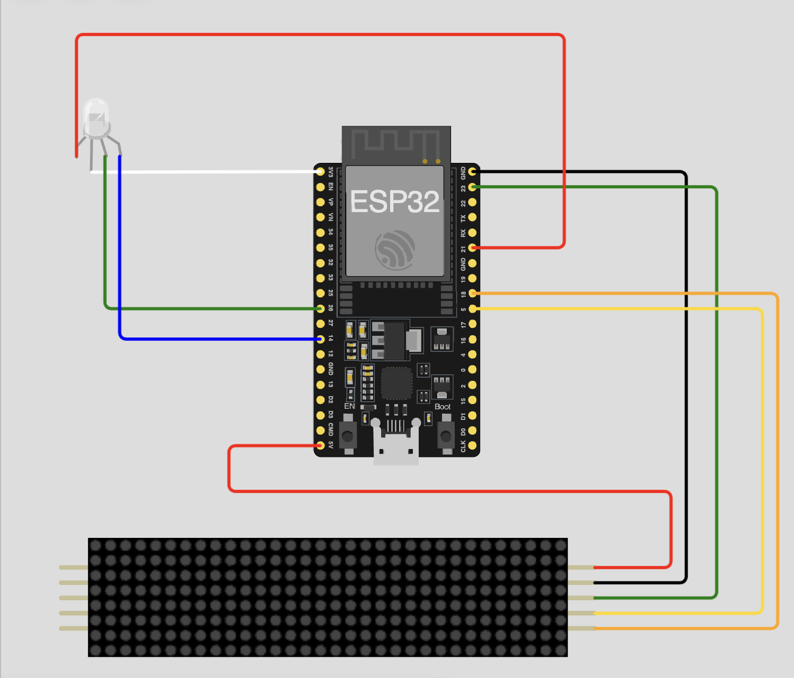

# 🕒 39th AIU Time Control System
> **An IoT-driven timing solution for the 39th AIU West Zone Youth Festival.**

  
  
<i>The physical BLE Timer IoT device in action at CVM University.</i>

---

### 🛠️ Tech Stack

---

### 🚀 Overview
The **39th AIU Time Control System** is a professional-grade speech timer designed to manage competitive university events with precision. It bridges the gap between physical hardware and mobile convenience using **ESP32** and **Bluetooth Low Energy (BLE)**.

---

### ✨ Key Features
* **📱 Smart Connectivity** — Automatic filtering and connection to `NOT_CNT_XXXX` devices.
* **⏲️ Advanced Timing** — Managed phases for **PREP**, **MIN**, **PERF**, and **GRACE** periods.
* **💡 Live Sync** — Real-time countdown on both the app and the physical 8x32 LED matrix.
* **🔒 Secure Operations** — PIN-based authentication to prevent unauthorized control during sessions.
* **📊 Performance Logs** — Automatically logs session data including configurations and total overtime.

---

### 🎨 Visual Feedback & Logic
The device communicates status through a high-visibility RGB LED and a matrix display:

| Phase | LED Color | Logic |
| :--- | :---: | :--- |
| **Preparation** | 🟡 Yellow | Counts down the user-defined setup time. |
| **Session Start** | 🟢 Green | Double green blink to signal the speaker to begin. |
| **Min Threshold** | 🔵 Blue | Quick blue flash when the minimum time is reached. |
| **Overtime (Grace)**| ⚫ Off | Display counts **UP**; no LED distractions for the speaker. |
| **Conclusion** | 🔴 Red | 5 red flashes to signal the official end of the round. |

---

### 📐 Hardware Architecture

  

* **Microcontroller:** ESP32 (utilizing BLE 4.2 stack).
* **Display:** MAX7219 Driven 8x32 LED Matrix (0-15 brightness levels).
* **Format:** Supports `MM:SS` and automatically switches to `H:MM` for sessions ≥ 100 minutes.

---

### ⚙️ How to Run
1.  **Hardware:** Flash the firmware to your ESP32 and wire according to the diagram above.
2.  **Permissions:** Ensure Bluetooth and Location (on Android) are enabled for scanning.
3.  **Authentication:** Set a 4-digit PIN upon first launch to secure the interface.
4.  **Testing:** Use the **"Test Device"** menu in Settings to run the R/G/B and Segment diagnostic.

---

  
<b>Developed for the Association of Indian Universities (AIU)</b> 
  <i>BLE Timer IoT App v1.0.0</i>

